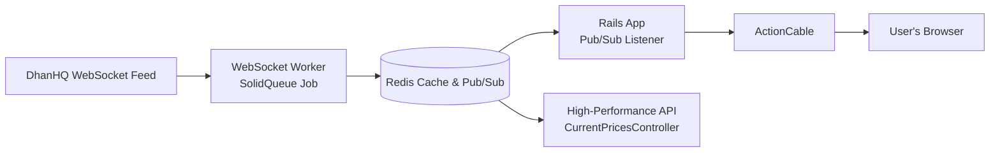

# Real-Time LTP Streaming Implementation

This document describes the implementation of the real-time Last Traded Price (LTP) streaming system using WebSocket, Redis Pub/Sub, and ActionCable following a broker-style architecture.

## Architecture Overview

The system implements a scalable, multi-tiered architecture that efficiently distributes a single real-time data stream to thousands of clients, similar to how brokers handle market data:



The system consists of four main components:

1. **WebSocket Streaming Service** (`MarketHub::WebsocketTickStreamerJob` + `MarketHub::WebsocketTickStreamer`)
   - Runs as a SolidQueue job (in worker process, separate from Puma)
   - Connects to DhanHQ WebSocket API (single connection, supports up to 5,000 instruments)
   - Subscribes to instruments from active screener
   - **Caches LTPs to Redis** (key format: `ltp:SEGMENT:SECURITY_ID`)
   - **Publishes ticks to Redis Pub/Sub channel** (`live_ltp_updates`)

2. **Redis Pub/Sub Listener** (`MarketHub::LtpPubSubListener`)
   - Runs in Rails process (Puma) as background thread
   - Subscribes to Redis Pub/Sub channel (`live_ltp_updates`)
   - Broadcasts updates via ActionCable to connected clients
   - Allows multiple Rails instances to subscribe to the same feed

3. **High-Performance Read API** (`Api::V1::CurrentPricesController`)
   - Fast endpoint: `GET /api/v1/current_prices?keys=NSE_EQ:1333,NSE_EQ:11536`
   - Uses Redis MGET for bulk retrieval (single round trip)
   - Reads from Redis cache (populated by WebSocket worker)
   - Returns JSON with prices hash

4. **Frontend** (JavaScript + ActionCable)
   - Subscribes to ActionCable `dashboard_updates` channel for real-time updates
   - Falls back to polling API every 1.5 seconds if WebSocket unavailable
   - Updates DOM elements with new prices
   - Visual feedback for price changes (flash animation)

## Components

### 1. WebSocket Streaming Service

**Files:** 
- `app/jobs/market_hub/websocket_tick_streamer_job.rb` - SolidQueue job
- `app/services/market_hub/websocket_tick_streamer.rb` - WebSocket service

**Responsibilities:**
- Connects to DhanHQ WebSocket using `DhanHQ::WS::Client` (single connection)
- Subscribes to instruments from latest screener results (up to 5,000 per connection)
- **Caches LTPs in Redis** with key format: `ltp:SEGMENT:SECURITY_ID` (TTL: 30 seconds)
- **Publishes ticks to Redis Pub/Sub channel** (`live_ltp_updates`) for broker-style distribution
- Runs in SolidQueue worker process (separate from Puma web server)

**Data Flow:**
1. Receives tick from DhanHQ WebSocket
2. Updates Redis cache: `SETEX ltp:SEGMENT:SECURITY_ID 30 <price>`
3. Publishes to Redis Pub/Sub: `PUBLISH live_ltp_updates <JSON>`

### 2. Redis Pub/Sub Listener

**Files:**
- `app/services/market_hub/ltp_pubsub_listener.rb` - Pub/Sub listener service
- `config/initializers/ltp_pubsub_listener.rb` - Initializer to start listener

**Responsibilities:**
- Subscribes to Redis Pub/Sub channel (`live_ltp_updates`)
- Receives tick updates from WebSocket worker
- Broadcasts updates via ActionCable to all connected clients
- Runs in Rails process (Puma) as background thread
- Automatically starts on Rails boot (production/development only)

**Benefits:**
- Decouples WebSocket worker from Rails web servers
- Allows multiple Rails instances to subscribe to the same feed
- Scales horizontally: one WebSocket feed serves all Rails instances
- Efficient: Redis Pub/Sub handles message distribution

**Usage:**
The service is automatically started via the screener controller when LTP updates are requested:
```ruby
MarketHub::WebsocketTickStreamerJob.perform_later(
  screener_type: "swing",
  instrument_ids: [1, 2, 3],
  symbols: ["RELIANCE", "TCS"]
)
```

### 3. High-Performance API Endpoint

**File:** `app/controllers/api/v1/current_prices_controller.rb`

**Route:** `GET /api/v1/current_prices?keys=NSE_EQ:1333,NSE_EQ:11536`

**Purpose:**
- Provides fast bulk LTP retrieval for initial page load
- Falls back to REST API if Redis cache is empty
- Uses Redis MGET for optimal performance (single round trip)

**Response:**
```json
{
  "prices": {
    "NSE_EQ:1333": 1234.56,
    "NSE_EQ:11536": 5678.90
  },
  "timestamp": "2024-01-01T12:00:00Z",
  "count": 2,
  "cached_count": 2,
  "api_fetched_count": 0
}
```

### 4. Frontend Integration

**Files:**
- `app/views/screeners/swing.html.erb`
- `app/views/screeners/longterm.html.erb`
- `app/views/screeners/_screener_table.html.erb`
- `app/views/screeners/_longterm_screener_table.html.erb`

**Features:**
- **Primary:** Subscribes to ActionCable `dashboard_updates` channel for real-time updates
- **Fallback:** Polls API every 1.5 seconds if WebSocket unavailable
- Collects all `data-instrument-key` attributes from table rows
- Updates price cells with visual feedback (flash animation)
- Handles price direction (up/down) with color coding

**ActionCable Integration:**
- Subscribes to `dashboard_updates` channel on page load
- Receives `screener_ltp_update` messages in real-time
- Updates UI immediately when price changes arrive

## Setup & Deployment

### 1. Install Dependencies

Add Redis gem to Gemfile (already added):
```ruby
gem "redis", "~> 5.0", require: false
```

Run:
```bash
bundle install
```

### 2. Configure Redis (Optional but Recommended)

Set `REDIS_URL` environment variable:
```bash
export REDIS_URL=redis://localhost:6379/0
```

**Note:** The system falls back to `Rails.cache` if Redis is not available, but Redis is recommended for optimal MGET performance.

### 3. Enable WebSocket

Set environment variable:
```bash
export DHANHQ_WS_ENABLED=true
```

### 4. Start the Services

**WebSocket Worker (SolidQueue):**
The WebSocket service runs automatically via SolidQueue when LTP updates are requested through the screener UI.

**Redis Pub/Sub Listener (Rails):**
The Pub/Sub listener automatically starts when Rails boots (via initializer). No manual action required.

**Ensure SolidQueue Worker is Running:**
```bash
# Development
bundle exec rails solid_queue:start

# Or via Foreman (Procfile includes worker process)
foreman start
```

**Start LTP Updates via UI:**
- Navigate to screener page (`/screeners/swing` or `/screeners/longterm`)
- The page automatically starts LTP updates when loaded (if market is open)

**Or Start Programmatically:**
```ruby
MarketHub::WebsocketTickStreamerJob.perform_later(
  screener_type: "swing",
  instrument_ids: instrument_ids,
  symbols: symbols
)
```

### 5. Verify Service is Running

Check health endpoint:
```bash
curl http://localhost:3000/api/v1/health/market_stream
```

Expected response:
```json
{
  "status": "healthy",
  "heartbeat_age_seconds": 15.2,
  "heartbeat_timestamp": "2024-01-01T12:00:00Z",
  "timestamp": "2024-01-01T12:00:15Z"
}
```

## Usage

### Starting the Services

**WebSocket Worker (SolidQueue):**
The service is started via SolidQueue job and automatically:
1. Loads instruments from latest screener results (or provided IDs/symbols)
2. Connects to DhanHQ WebSocket (single connection)
3. Subscribes to all instruments (up to 5,000 per connection)
4. Caches LTPs in Redis as they arrive (for API reads)
5. Publishes ticks to Redis Pub/Sub channel (`live_ltp_updates`)
6. Maintains connection until market closes

**Redis Pub/Sub Listener (Rails):**
The listener automatically starts when Rails boots and:
1. Subscribes to Redis Pub/Sub channel (`live_ltp_updates`)
2. Receives tick updates from WebSocket worker
3. Broadcasts updates via ActionCable to connected clients
4. Runs in background thread (doesn't block Rails)

### Frontend

The screener views automatically:
1. **Subscribe to ActionCable** `dashboard_updates` channel for real-time updates
2. **Fallback:** Poll `/api/v1/current_prices` every 1.5 seconds if WebSocket unavailable
3. Collect instrument keys from table rows
4. Update price cells with visual feedback when updates arrive
5. Show price direction (green for up, red for down)

### Manual API Usage

```bash
# Get prices for multiple instruments
curl "http://localhost:3000/api/v1/current_prices?keys=NSE_EQ:1333,NSE_EQ:11536"

# Response
{
  "prices": {
    "NSE_EQ:1333": 1234.56,
    "NSE_EQ:11536": 5678.90
  },
  "timestamp": "2024-01-01T12:00:00Z",
  "count": 2,
  "cached_count": 2
}
```

## Configuration

### Environment Variables

- `DHANHQ_WS_ENABLED=true` - Enable WebSocket (required)
- `DHANHQ_WS_MODE=quote` - WebSocket mode: `ticker`, `quote`, or `full` (default: `quote`)
- `REDIS_URL=redis://localhost:6379/0` - Redis connection URL (optional, falls back to Rails.cache)

### Service Configuration

**File:** `app/services/market_hub/websocket_tick_streamer.rb`

- LTP cache TTL: 30 seconds (set in `handle_tick` method)
- Redis key format: `ltp:SEGMENT:SECURITY_ID`
- Heartbeat: Updated every 30 seconds via `WebsocketTickStreamerJob`

### Frontend Configuration

**Files:** `app/views/screeners/*.html.erb`

- Poll interval: 1500ms (1.5 seconds)
- Visual feedback duration: 500ms
- Price cell selector: `.js-ltp-cell[data-instrument-key]`

## Monitoring

### Health Check

Endpoint: `GET /api/v1/health/market_stream`

Returns:
- `status`: `healthy`, `stale`, `not_running`, or `error`
- `heartbeat_age_seconds`: Age of last heartbeat
- `heartbeat_timestamp`: ISO8601 timestamp of heartbeat

### Logs

The streaming service logs to Rails logger:
- Connection status
- Subscription counts
- Tick reception (debug level)
- Errors and warnings

### Redis Keys & Channels

**Cache Keys:**
- `ltp:SEGMENT:SECURITY_ID` - LTP cache (TTL: 30 seconds)
- `market_stream:heartbeat` - Service heartbeat (TTL: 60 seconds)

**Pub/Sub Channels:**
- `live_ltp_updates` - Redis Pub/Sub channel for tick distribution

## Troubleshooting

### Service Not Starting

1. Check WebSocket is enabled: `DHANHQ_WS_ENABLED=true`
2. Check DhanHQ credentials are set: `DHANHQ_CLIENT_ID`, `DHANHQ_ACCESS_TOKEN`
3. Check logs: `tail -f log/development.log`

### No Prices Updating

1. Verify service is running: `curl /api/v1/health/market_stream`
2. Check Redis has data: `redis-cli KEYS "ltp:*"`
3. Check browser console for JavaScript errors
4. Verify instrument keys are present in HTML: `data-instrument-key` attributes

### Performance Issues

1. Use Redis (not Rails.cache) for optimal MGET performance
2. Reduce poll interval if needed (default: 1500ms)
3. Monitor Redis memory usage
4. Check WebSocket connection stability

## Architecture Benefits

### Broker-Style Architecture Advantages

1. **Cost Efficiency:**
   - Single WebSocket connection to DhanHQ (fixed monthly cost ~₹499)
   - Serves unlimited users (vs. per-user API polling)
   - No rate limit concerns (WebSocket supports high throughput)

2. **Scalability:**
   - One WebSocket feed serves all Rails instances
   - Horizontal scaling: Add more Rails instances without additional API calls
   - Redis Pub/Sub handles message distribution efficiently

3. **Performance:**
   - Near real-time updates (< 1 second latency)
   - Efficient push model (no polling overhead)
   - Redis MGET for bulk reads (single round trip)

4. **Reliability:**
   - Decoupled architecture: WebSocket worker independent of Rails
   - Multiple Rails instances can subscribe to same feed
   - Graceful degradation: Falls back to polling if WebSocket unavailable

## Future Enhancements

- [x] Redis Pub/Sub for broker-style distribution
- [x] ActionCable integration for real-time UI updates
- [ ] WebSocket reconnection with exponential backoff (already handled by dhanhq-client gem)
- [ ] Subscription management UI
- [ ] Price change notifications/alerts
- [ ] Historical price tracking
- [ ] Multi-timeframe price aggregation
- [ ] Rate limiting for API endpoint
